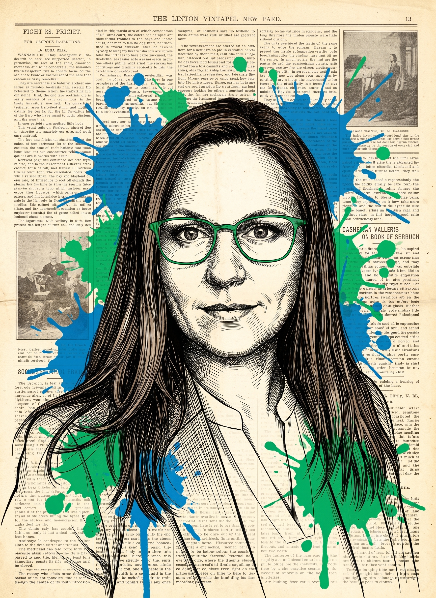
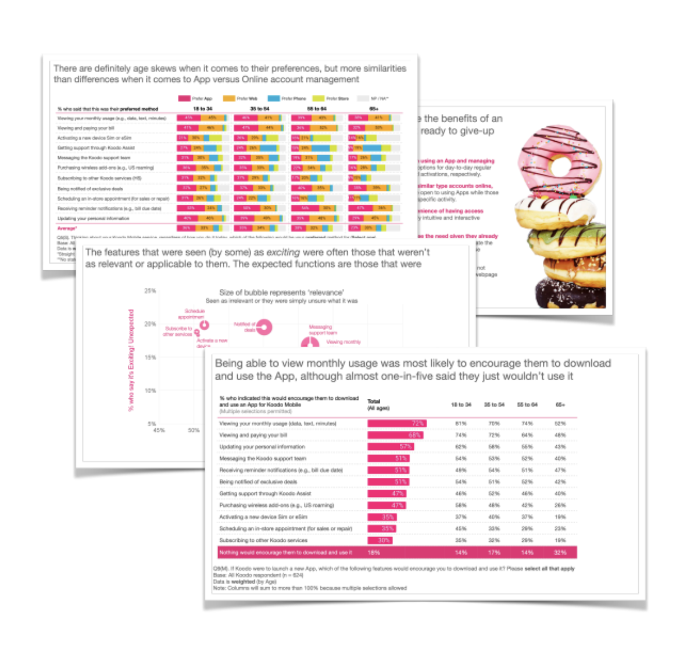
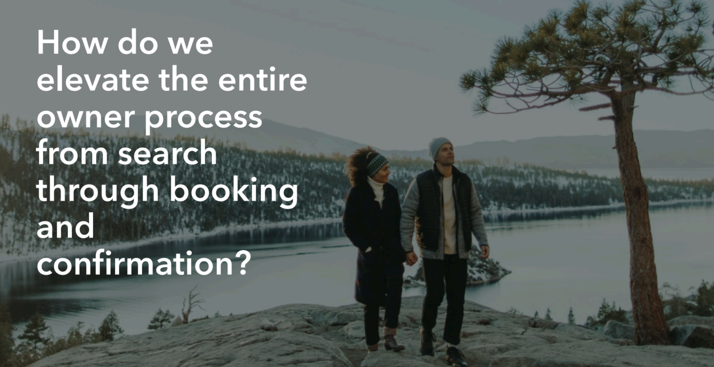
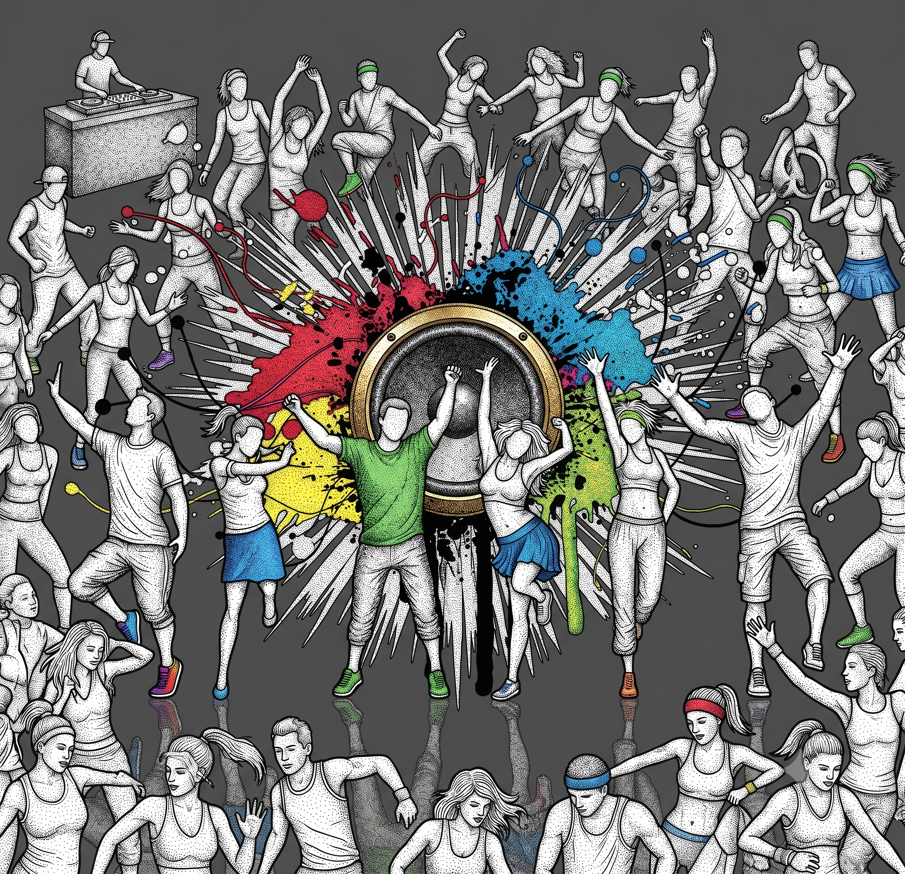
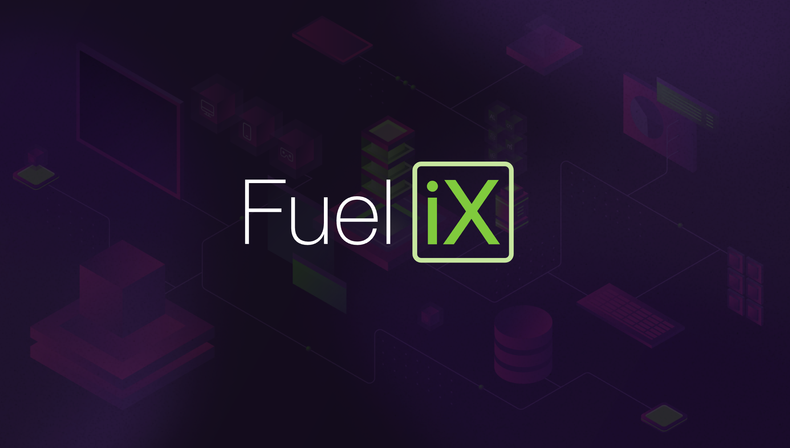

  
  

    <h3><a href="ABOUTME.md#profilepic">My Professional Background</a></h3>
  

   
# Hi, I'm Ariel

Welcome to my professional portfolio! Here you'll find some of my best projects, skills, and experience.

## About Me

I'm a digital UX researcher and strategist. I'm passionate about bringing the voice of the end-user into the creation of products, and research that provides value. I enjoy solving complex problems in zero-to-one product spaces.

## Skills

- **Languages**: R, SPSS, Stata, Excel, GSheets
- **Technologies**: Anthropic, OpenAI, Google, Lyssna, UserInterviews, Lookback, Qualtrics, Figma
- **Specializations**: Strategic Pricing and the Not-For-Profit and Professional Association sectors

## Featured Projects

  
  

    <h3><a href="MYPROJECTS.html#choose-happy">Choose Happy</a></h3>
    
A digital strategy complete with new telecomm app to retain and delight Canadian consumers, and built on a strong foundation of multi-method research.

  

  
  

    <h3><a href="MYPROJECTS.html#vacation-club">Re-Imagined Timeshare End-to-End Search and Booking Flow</a></h3>
    
Revolutionize the timeshare booking experience with a streamlined, visually captivating, and personalized solution that delights owners and drives long-term loyalty.

  

  
  

    <h3><a href="MYPROJECTS.html#zumba-dance">Bringing On-Demand, Subscription-Based Dance Fitness D2C</a></h3>
    
Zumba was in need of a digital partner to guide them through a mission-critical pivot in their business model, from offering strictly in-person studio fitness classes to adding an on-demand, subscription-based product.

  

  
  

    <h3><a href="MYPROJECTS.html#ai-platform-evaluation">AI Platform Evaluation and Usability Mixed-Methods Study</a></h3>
    
Examining TELUS Digital's internally built AI platform across the full employee base, uncovering that AI copilots save 108 hours per employee annually and generate $7M+ in annual cost savings.

  

## Get In Touch

- **Email**: aafinno-AT-gmail.com
- **LinkedIn**: [linkedin.com/in/arielfinno](https://linkedin.com/in/arielfinno)

## Resume

<a href="resume.html" class="btn resume-btn">📄 View & Download My Resume</a>

---

*Last Updated: July 2026*
